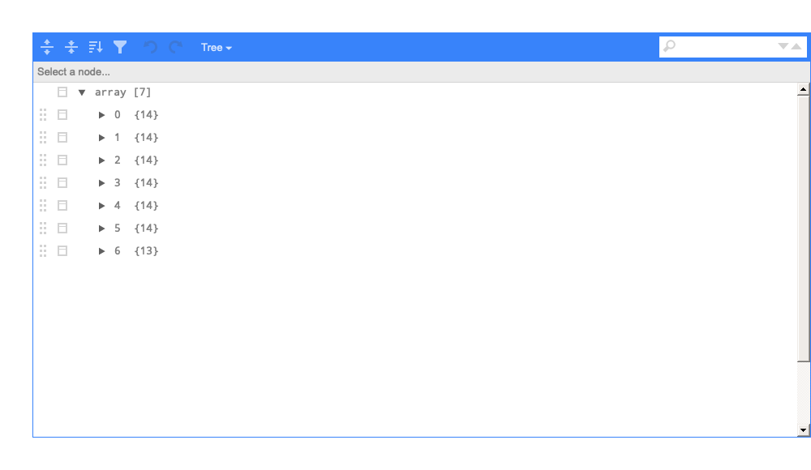

Notes from Advanced R, 2nd Ed, 3: Subsetting
================

## Types of subsetting

``` r
library(repurrrsive)
library(tidyverse)
library(lazyeval)
```

We can use `[[]]`, `[]` and `$`.

If we have a `data.frame` we get the following output:

``` r
# what am I?
str(mtcars)
```

    #>  'data.frame':   32 obs. of  11 variables:
    #>   $ mpg : num  21 21 22.8 21.4 18.7 18.1 14.3 24.4 22.8 19.2 ...
    #>   $ cyl : num  6 6 4 6 8 6 8 4 4 6 ...
    #>   $ disp: num  160 160 108 258 360 ...
    #>   $ hp  : num  110 110 93 110 175 105 245 62 95 123 ...
    #>   $ drat: num  3.9 3.9 3.85 3.08 3.15 2.76 3.21 3.69 3.92 3.92 ...
    #>   $ wt  : num  2.62 2.88 2.32 3.21 3.44 ...
    #>   $ qsec: num  16.5 17 18.6 19.4 17 ...
    #>   $ vs  : num  0 0 1 1 0 1 0 1 1 1 ...
    #>   $ am  : num  1 1 1 0 0 0 0 0 0 0 ...
    #>   $ gear: num  4 4 4 3 3 3 3 4 4 4 ...
    #>   $ carb: num  4 4 1 1 2 1 4 2 2 4 ...

``` r
# what do I return?
str(mtcars$mpg) # vector
```

    #>   num [1:32] 21 21 22.8 21.4 18.7 18.1 14.3 24.4 22.8 19.2 ...

``` r
# what do I return?
str(mtcars["mpg"]) # data.frame
```

    #>  'data.frame':   32 obs. of  1 variable:
    #>   $ mpg: num  21 21 22.8 21.4 18.7 18.1 14.3 24.4 22.8 19.2 ...

``` r
# what do I return?
str(mtcars[["mpg"]]) # vector
```

    #>   num [1:32] 21 21 22.8 21.4 18.7 18.1 14.3 24.4 22.8 19.2 ...

``` r
# what do I return?
str(subset(x = mtcars, select = "mpg"))
```

    #>  'data.frame':   32 obs. of  1 variable:
    #>   $ mpg: num  21 21 22.8 21.4 18.7 18.1 14.3 24.4 22.8 19.2 ...

If we have a `tibble` we get the following output:

``` r
# convert
mtcars_tibble <- as_tibble(x = mtcars)
# what am I?
str(mtcars_tibble) # tibble (S3: tbl_df/tbl/data.frame)
```

    #>  tibble [32 × 11] (S3: tbl_df/tbl/data.frame)
    #>   $ mpg : num [1:32] 21 21 22.8 21.4 18.7 18.1 14.3 24.4 22.8 19.2 ...
    #>   $ cyl : num [1:32] 6 6 4 6 8 6 8 4 4 6 ...
    #>   $ disp: num [1:32] 160 160 108 258 360 ...
    #>   $ hp  : num [1:32] 110 110 93 110 175 105 245 62 95 123 ...
    #>   $ drat: num [1:32] 3.9 3.9 3.85 3.08 3.15 2.76 3.21 3.69 3.92 3.92 ...
    #>   $ wt  : num [1:32] 2.62 2.88 2.32 3.21 3.44 ...
    #>   $ qsec: num [1:32] 16.5 17 18.6 19.4 17 ...
    #>   $ vs  : num [1:32] 0 0 1 1 0 1 0 1 1 1 ...
    #>   $ am  : num [1:32] 1 1 1 0 0 0 0 0 0 0 ...
    #>   $ gear: num [1:32] 4 4 4 3 3 3 3 4 4 4 ...
    #>   $ carb: num [1:32] 4 4 1 1 2 1 4 2 2 4 ...

``` r
# what do I return?
str(mtcars_tibble$mpg) # vector
```

    #>   num [1:32] 21 21 22.8 21.4 18.7 18.1 14.3 24.4 22.8 19.2 ...

``` r
# what do I return?
str(mtcars_tibble["mpg"]) # tibble (S3: tbl_df/tbl/data.frame)
```

    #>  tibble [32 × 1] (S3: tbl_df/tbl/data.frame)
    #>   $ mpg: num [1:32] 21 21 22.8 21.4 18.7 18.1 14.3 24.4 22.8 19.2 ...

``` r
# what do I return?
str(mtcars_tibble[["mpg"]]) # vector
```

    #>   num [1:32] 21 21 22.8 21.4 18.7 18.1 14.3 24.4 22.8 19.2 ...

``` r
# what do I return?
str(subset(x = mtcars_tibble, select = "mpg"))
```

    #>  tibble [32 × 1] (S3: tbl_df/tbl/data.frame)
    #>   $ mpg: num [1:32] 21 21 22.8 21.4 18.7 18.1 14.3 24.4 22.8 19.2 ...

### Everything is function

You’ll often hear/read the subsetting characters referred to as
‘operators’, but they are actually functions.

``` r
class(`[`)
```

    #>  [1] "function"

``` r
class(`[[`)
```

    #>  [1] "function"

``` r
class(`$`)
```

    #>  [1] "function"

``` r
class(`<-`)
```

    #>  [1] "function"

### Use case (selecting file based metadata or name)

Assume I have data from a folder with timestamp in the file name (these
data come from the [COVID-19 Data Repository by the Center for Systems
Science and Engineering (CSSE) at Johns Hopkins
University](https://github.com/CSSEGISandData/COVID-19))

``` r
fs::dir_tree("data/covid-data")
```

    #>  data/covid-data
    #>  ├── 2021-03-01-hopkins-us-daily.csv
    #>  ├── 2021-03-02-hopkins-us-daily.csv
    #>  ├── 2021-03-03-hopkins-us-daily.csv
    #>  └── 2021-03-04-hopkins-us-daily.csv

I want to import **only the newest data, based on the file name**. I can
use `dplyr` and `purrr::as_vector()` with `.[1]` to get the most recent
data.

``` r
fs::dir_info("data/covid-data") %>%
  dplyr::select(path) %>%
  dplyr::arrange(desc(path)) %>%
  purrr::as_vector() %>%
  .[1] %>%
  readr::read_csv(.) %>%
  utils::head()
```

    #>  # A tibble: 6 x 18
    #>    Province_State Country_Region Last_Update           Lat  Long_ Confirmed
    #>    <chr>          <chr>          <dttm>              <dbl>  <dbl>     <dbl>
    #>  1 Alabama        US             2021-03-05 05:31:07  32.3  -86.9    498076
    #>  2 Alaska         US             2021-03-05 05:31:07  61.4 -152.      59138
    #>  3 American Samoa US             2021-03-05 05:31:07 -14.3 -170.          0
    #>  4 Arizona        US             2021-03-05 05:31:07  33.7 -111.     821108
    #>  5 Arkansas       US             2021-03-05 05:31:07  35.0  -92.4    323756
    #>  6 California     US             2021-03-05 08:30:53  36.1 -120.    3587567
    #>  # … with 12 more variables: Deaths <dbl>, Recovered <dbl>, Active <dbl>,
    #>  #   FIPS <dbl>, Incident_Rate <dbl>, Total_Test_Results <dbl>,
    #>  #   People_Hospitalized <lgl>, Case_Fatality_Ratio <dbl>, UID <dbl>,
    #>  #   ISO3 <chr>, Testing_Rate <dbl>, Hospitalization_Rate <lgl>

Or I can use `slice()` and `as.character()`

``` r
fs::dir_info("data/covid-data") %>%
  dplyr::select(path) %>%
  dplyr::arrange(desc(path)) %>%
  dplyr::slice(1) %>%
  base::as.character() %>%
  readr::read_csv(.) %>%
  utils::head()
```

    #>  # A tibble: 6 x 18
    #>    Province_State Country_Region Last_Update           Lat  Long_ Confirmed
    #>    <chr>          <chr>          <dttm>              <dbl>  <dbl>     <dbl>
    #>  1 Alabama        US             2021-03-05 05:31:07  32.3  -86.9    498076
    #>  2 Alaska         US             2021-03-05 05:31:07  61.4 -152.      59138
    #>  3 American Samoa US             2021-03-05 05:31:07 -14.3 -170.          0
    #>  4 Arizona        US             2021-03-05 05:31:07  33.7 -111.     821108
    #>  5 Arkansas       US             2021-03-05 05:31:07  35.0  -92.4    323756
    #>  6 California     US             2021-03-05 08:30:53  36.1 -120.    3587567
    #>  # … with 12 more variables: Deaths <dbl>, Recovered <dbl>, Active <dbl>,
    #>  #   FIPS <dbl>, Incident_Rate <dbl>, Total_Test_Results <dbl>,
    #>  #   People_Hospitalized <lgl>, Case_Fatality_Ratio <dbl>, UID <dbl>,
    #>  #   ISO3 <chr>, Testing_Rate <dbl>, Hospitalization_Rate <lgl>

## `purrr` subsetting

The `purrr` package has some great functions for subsetting lists.

### `keep()`

`keep()` is a great one. Here is an example with `mtcars`

``` r
purrr::keep(.x = mtcars, function(x) {
  3 %in% x
})
```

    #>                      drat gear carb
    #>  Mazda RX4           3.90    4    4
    #>  Mazda RX4 Wag       3.90    4    4
    #>  Datsun 710          3.85    4    1
    #>  Hornet 4 Drive      3.08    3    1
    #>  Hornet Sportabout   3.15    3    2
    #>  Valiant             2.76    3    1
    #>  Duster 360          3.21    3    4
    #>  Merc 240D           3.69    4    2
    #>  Merc 230            3.92    4    2
    #>  Merc 280            3.92    4    4
    #>  Merc 280C           3.92    4    4
    #>  Merc 450SE          3.07    3    3
    #>  Merc 450SL          3.07    3    3
    #>  Merc 450SLC         3.07    3    3
    #>  Cadillac Fleetwood  2.93    3    4
    #>  Lincoln Continental 3.00    3    4
    #>  Chrysler Imperial   3.23    3    4
    #>  Fiat 128            4.08    4    1
    #>  Honda Civic         4.93    4    2
    #>  Toyota Corolla      4.22    4    1
    #>  Toyota Corona       3.70    3    1
    #>  Dodge Challenger    2.76    3    2
    #>  AMC Javelin         3.15    3    2
    #>  Camaro Z28          3.73    3    4
    #>  Pontiac Firebird    3.08    3    2
    #>   [ reached 'max' / getOption("max.print") -- omitted 7 rows ]

And here is an example with `mtcars` as a list.

``` r
purrr::keep(.x = as.list(mtcars), function(x) {
  3 %in% x
})
```

    #>  $drat
    #>   [1] 3.90 3.90 3.85 3.08 3.15 2.76 3.21 3.69 3.92 3.92 3.92 3.07 3.07 3.07 2.93
    #>  [16] 3.00 3.23 4.08 4.93 4.22 3.70 2.76 3.15 3.73 3.08 4.08 4.43 3.77 4.22 3.62
    #>  [31] 3.54 4.11
    #>  
    #>  $gear
    #>   [1] 4 4 4 3 3 3 3 4 4 4 4 3 3 3 3 3 3 4 4 4 3 3 3 3 3 4 5 5 5 5 5 4
    #>  
    #>  $carb
    #>   [1] 4 4 1 1 2 1 4 2 2 4 4 3 3 3 4 4 4 1 2 1 1 2 2 4 2 1 2 2 4 6 8 2

## `select_list()`

It’s like, `dplyr::select()`, but for lists.

``` r
select_list <- function(list_input, ...) {
  cols <- lazyeval::lazy_dots(...)

  columns <- purrr::map_chr(
    cols,
    function(x) {
      as.character(x$expr)
    }
  )

  base::unlist(
    x = list_input[columns],
    recursive = FALSE
  )
}
```

When we test `select_list()`, we see all the items are named.

``` r
select_list(list_input = as.list(mtcars), mpg)
```

    #>   mpg1  mpg2  mpg3  mpg4  mpg5  mpg6  mpg7  mpg8  mpg9 mpg10 mpg11 mpg12 mpg13 
    #>   21.0  21.0  22.8  21.4  18.7  18.1  14.3  24.4  22.8  19.2  17.8  16.4  17.3 
    #>  mpg14 mpg15 mpg16 mpg17 mpg18 mpg19 mpg20 mpg21 mpg22 mpg23 mpg24 mpg25 mpg26 
    #>   15.2  10.4  10.4  14.7  32.4  30.4  33.9  21.5  15.5  15.2  13.3  19.2  27.3 
    #>  mpg27 mpg28 mpg29 mpg30 mpg31 mpg32 
    #>   26.0  30.4  15.8  19.7  15.0  21.4

I also played around with a function that would find the elements in the
list by position and name, but this has limited application because of
what you’d need to know about the structure of this list before using.

``` r
select_list_pos_name <- function(list_object, position, name) {
  nm <- base::as.character(name)
  pos <- base::as.integer(position)

  purrr::as_vector(list_object[[pos]][nm])
}
```

``` r
# for got_chars
select_list_pos_name(list_object = got_chars, position = 2, name = "url")
```

    #>                                                      url 
    #>  "https://www.anapioficeandfire.com/api/characters/1052"

## `list_select()` from JP

`list_select()` was added to Slack and improves on the functions above.

``` r
list_select <- function(list, ..., by = "name") {
  items <- lazyeval::lazy_dots(...)
  if (by == "name") {
    items <- purrr::map_chr(items, function(x) {
      as.character(x$expr)
    })
    if (is.null(list[[items]])) {
      return(NULL)
    }
    return(list[items])
  } else if (by == "position") {
    # browser()
    items <- purrr::map_dbl(items, function(x) {
      as.numeric(x$expr)
    })
    list <- purrr::map(
      items,
      function(x) {
        if (!is.null(list[x][[1]])) {
          return(list[x])
        }
      }
    )
    return(list)
  }
}
```

When we test it, we see the following:

``` r
my_list <- list(a = "string", 
             `1` = "string",
             "b" = list("wlek",
                        "name" = list("string")),
             "cstring")
my_list
```

    #>  $a
    #>  [1] "string"
    #>  
    #>  $`1`
    #>  [1] "string"
    #>  
    #>  $b
    #>  $b[[1]]
    #>  [1] "wlek"
    #>  
    #>  $b$name
    #>  $b$name[[1]]
    #>  [1] "string"
    #>  
    #>  
    #>  
    #>  [[4]]
    #>  [1] "cstring"

``` r
my_list %>% list_select(a)
```

    #>  $a
    #>  [1] "string"

``` r
my_list %>% list_select(1)
```

    #>  $`1`
    #>  [1] "string"

``` r
my_list %>% list_select(`1`)
```

    #>  $`1`
    #>  [1] "string"

``` r
my_list %>% list_select(b)
```

    #>  $b
    #>  $b[[1]]
    #>  [1] "wlek"
    #>  
    #>  $b$name
    #>  $b$name[[1]]
    #>  [1] "string"

``` r
my_list %>% list_select(missing_item)
```

    #>  NULL

``` r
my_list %>% list_select("nothing")
```

    #>  NULL

``` r
my_list %>% list_select(b) %>% list_select(b$name)
```

    #>  Error: Result 1 must be a single string, not a character vector of length 3

``` r
my_list %>% list_select(1,6, by = 'position')
```

    #>  [[1]]
    #>  [[1]]$a
    #>  [1] "string"
    #>  
    #>  
    #>  [[2]]
    #>  NULL

## Honorable mention

Whenever I am dealing with a lot of lists, I use the `listviewer`
package to dig into their contents.

``` r
library(listviewer)
listviewer::jsonedit(listdata = sw_films)
```

<!-- -->
